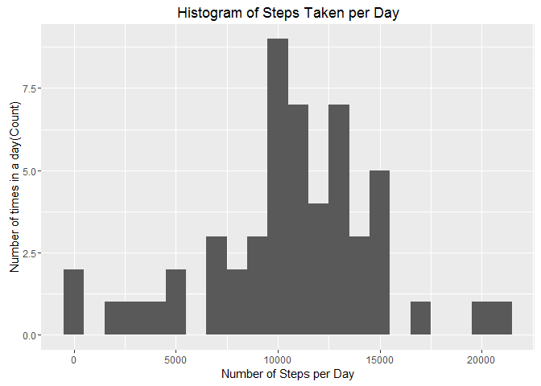
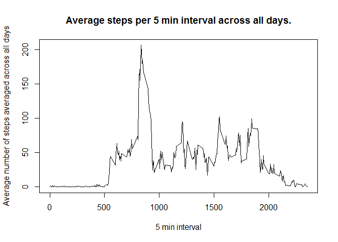
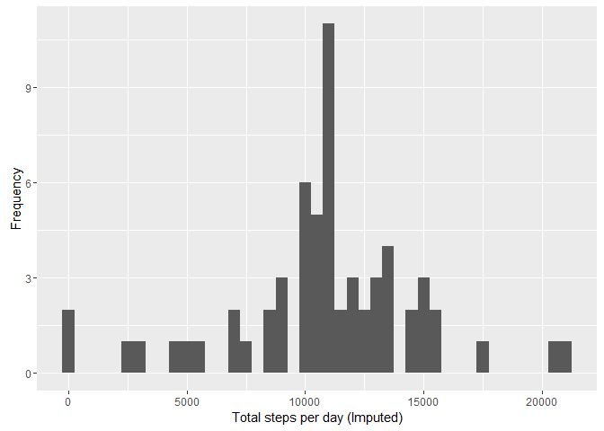
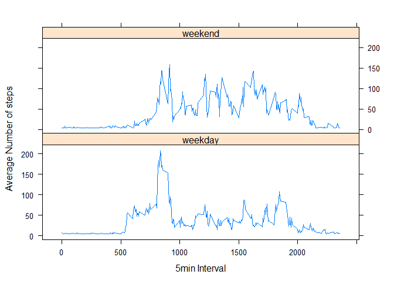

# Reproducible Research: Peer Assessment 1
Lee Davies  
July 1, 2016  


This assignment makes use of data from a personal activity monitoring device. This device collects data at 5 minute intervals through out the day. The data consists of two months of data from an anonymous individual collected during the months of October and November, 2012 and include the number of steps taken in 5 minute intervals each day.


```r
library(ggplot2)
library(Hmisc)
library(lubridate)
```

## Loading and preprocessing the data
Load the data into a variable called activitydata from the zip file. The activity.zip file is included in the Github repository. 

```r
activitydata = read.csv(unzip("activity.zip"), header = TRUE)
```

Date was processed by converting the date to a date type.

```r
# convert the date to a date type
activitydata$date <- as.Date(activitydata$date, "%Y-%m-%d")
# show the compact display for the processed data
str(activitydata)
```

```
## 'data.frame':	17568 obs. of  3 variables:
##  $ steps   : int  NA NA NA NA NA NA NA NA NA NA ...
##  $ date    : Date, format: "2012-10-01" "2012-10-01" ...
##  $ interval: int  0 5 10 15 20 25 30 35 40 45 ...
```
* steps: Number of steps taken in a 5 min interval
* date: The date on which the measurment was taken
* interval: 5 min interval in which the measurement was taken

## What is mean total number of steps taken per day?
Create the sum of the total number of steps per day.

```r
#calculate the sum of the steps per day
sumStepsPerDay = aggregate(steps ~ date, data=activitydata, FUN="sum")
# set the column names
colnames(sumStepsPerDay) <- c("date", "steps")
# compact display of data
str(sumStepsPerDay)
```

```
## 'data.frame':	53 obs. of  2 variables:
##  $ date : Date, format: "2012-10-02" "2012-10-03" ...
##  $ steps: int  126 11352 12116 13294 15420 11015 12811 9900 10304 17382 ...
```

```r
# show the first couple of rows of data
head(sumStepsPerDay)
```

```
##         date steps
## 1 2012-10-02   126
## 2 2012-10-03 11352
## 3 2012-10-04 12116
## 4 2012-10-05 13294
## 5 2012-10-06 15420
## 6 2012-10-07 11015
```

```r
# draw a histogram using the ggplot package
ggplot(sumStepsPerDay, aes(x = steps)) + 
       geom_histogram(binwidth = 1000) + 
        labs(title="Histogram of Steps Taken per Day", 
             x = "Number of Steps per Day", y = "Number of times in a day(Count)") 
```

<!-- -->

## What is the mean and median of the number of steps per day
Computing the mean and median of the number of steps per day ignoring any missing data.

```r
meanNoOfStepsPerDay = mean(sumStepsPerDay$steps, na.rm = TRUE)
meanNoOfStepsPerDay
```

```
## [1] 10766.19
```


```r
medianNoOfStepsPerDay = median(sumStepsPerDay$steps, na.rm = TRUE)
medianNoOfStepsPerDay
```

```
## [1] 10765
```

The mean of the number per steps per day (ignoring NA values) is **1.0766189\times 10^{4}** and the median (ignoring NA values) is **10765**.

## What is the average daily activity pattern?

```r
averageStepsPerInterval <- aggregate(activitydata$steps, 
                                     by = list(interval = activitydata$interval), 
                                     FUN = mean, na.rm = TRUE)
colnames(averageStepsPerInterval) <- c("interval","avgstepsperinterval")

str(averageStepsPerInterval)
```

```
## 'data.frame':	288 obs. of  2 variables:
##  $ interval           : int  0 5 10 15 20 25 30 35 40 45 ...
##  $ avgstepsperinterval: num  1.717 0.3396 0.1321 0.1509 0.0755 ...
```

```r
head(averageStepsPerInterval)
```

```
##   interval avgstepsperinterval
## 1        0           1.7169811
## 2        5           0.3396226
## 3       10           0.1320755
## 4       15           0.1509434
## 5       20           0.0754717
## 6       25           2.0943396
```

Plot of the average number of steps for each time interval across all days.


```r
with(averageStepsPerInterval, {
    plot(x=interval, 
         y = avgstepsperinterval,
         type = "l",
         main = "Average steps per 5 min interval across all days.",
         xlab = "5 min interval", 
         ylab = "Average number of steps averaged across all days")
})
```

<!-- -->

Determine which interval has the most steps.

```r
intervalWithMostSteps <- averageStepsPerInterval$interval[which.max(averageStepsPerInterval$avgstepsperinterval)]
intervalWithMostSteps
```

```
## [1] 835
```

The interval with on average the most steps between **835** and **840**.

## Imputing missing values
Find the total number od missin values in the origional data set.

```r
noOfMissingValues <- sum(is.na(activitydata$steps))
noOfMissingValues
```

```
## [1] 2304
```

There are **2304** in the activity dataset.

Using the impute function to fill in the missing data based on the mean step value.

```r
activitydataWithImputedValues <- data.frame(activitydata)
activitydataWithImputedValues$steps <- impute(activitydata$steps, fun=mean)
```

Check that there are no NA values left.

```r
noOfMissingValues <- sum(is.na(activitydataWithImputedValues$steps))
```

After imputing the data there are **0** in the dataset.  
Calculate the sum for the steps with the imputed values, plot the data and calculate the mean and median.


```r
sumStepsPerDayImputed <- tapply(activitydataWithImputedValues$steps,
                                        activitydataWithImputedValues$date, sum)
qplot(sumStepsPerDayImputed, 
      xlab='Total steps per day (Imputed)', 
      ylab='Frequency',
      binwidth = 500)
```

<!-- -->

```r
# calculate the mean based on the imputed data set
imputedMeanNoOfStepsPerDay = mean(sumStepsPerDayImputed)
imputedMeanNoOfStepsPerDay
```

```
## [1] 10766.19
```

```r
# calculate the median based on the imputed data set
imputedMedianNoOfStepsPerDay = median(sumStepsPerDayImputed)
imputedMedianNoOfStepsPerDay
```

```
## [1] 10766.19
```

###  What is the impact of imputing missing data on the estimates of the total daily number of steps? 
The mean of the number per steps per day **(ignoring NA values)** is **1.0766189\times 10^{4}** and the median is **10765**.

The mean of the number per steps per day **(with imputed values)** is **1.0766189\times 10^{4}** and the median is **1.0766189\times 10^{4}**.

After replacing the NA values there is little diference in the mean or median of the data set.

## Are there differences in activity patterns between weekdays and weekends?
Split the data into two groups determined by whether the date the number of steps recorded was on a weekend or week day. Average the steps for the intervals within each group and plot the data.

```r
# determine whether the date is on a weekend or week day
activitydataWithImputedValues$dateType <- ifelse(wday(activitydataWithImputedValues$date) %in% c(2:6), 'weekday', 'weekend')
# average the date based steps per interval based on whether the data is on a weekend or week day.
averagedActivityDataImputed <- aggregate(steps ~ interval + dateType, data=activitydataWithImputedValues, mean)
# plot the data
with(averagedActivityDataImputed, 
     xyplot(steps ~ interval | dateType, type = "l", layout = c(1, 2), 
    xlab = "5min Interval", ylab = "Average Number of steps"))
```

<!-- -->
